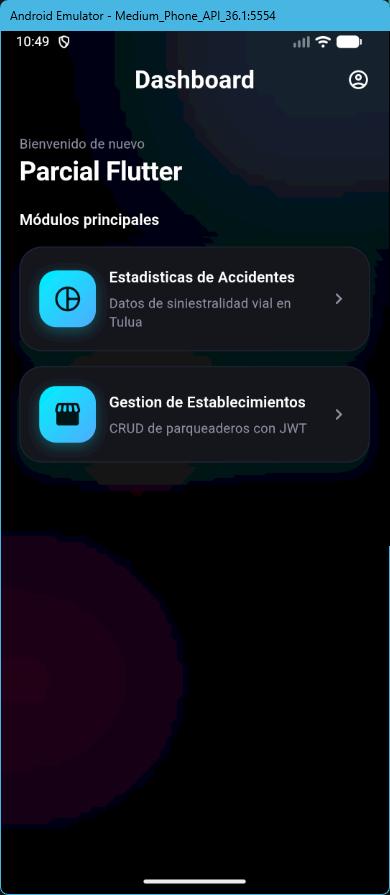
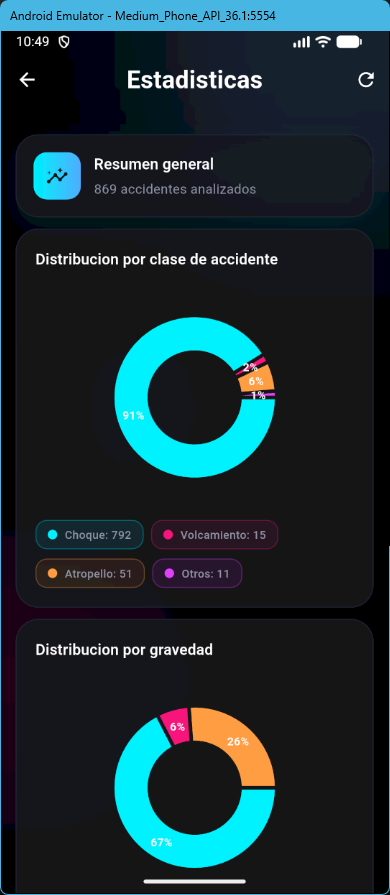
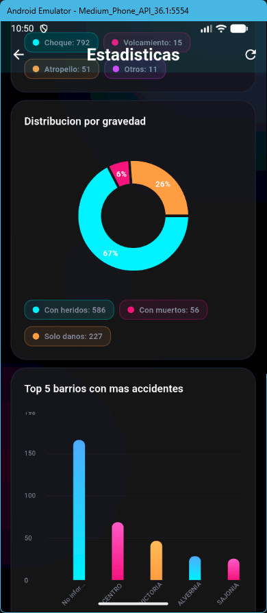
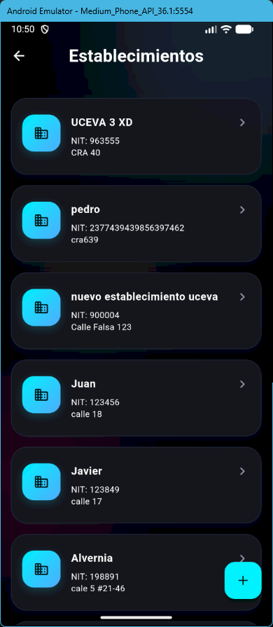
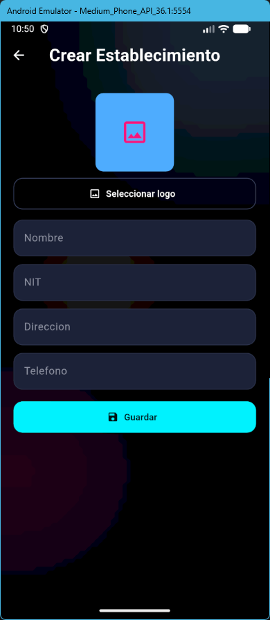
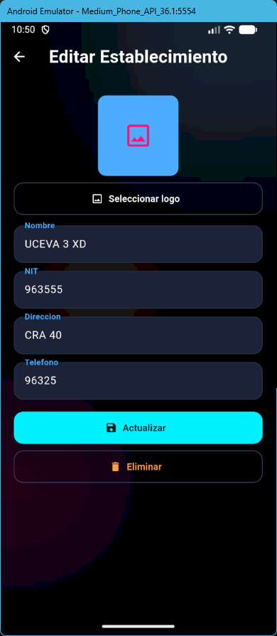

# Parcial 2 - Flutter Premium Dashboard

Este proyecto es una aplicación de Flutter diseñada con una estética moderna y "eléctrica", que integra el consumo de dos APIs distintas: una para análisis de datos estadísticos de accidentes de tránsito en Tuluá y otra para la gestión (CRUD) de establecimientos de parqueo.

## Características Principales

- **Diseño Premium**: Interfaz oscura con degradados neón, efectos de desenfoque (`BackdropFilter`) y animaciones sutiles.
- **Análisis de Datos**: Procesamiento pesado de JSON mediante **Isolates** para mantener la fluidez de la UI (60 FPS).
- **Gestión CRUD**: Sistema completo de creación, lectura, actualización y eliminación de establecimientos.
- **Seguridad**: Integración con autenticación JWT para operaciones de escritura.
- **Navegación Robusta**: Implementación de `go_router` con rutas parametrizadas.
- **Estados de Carga**: Uso de `Skeletonizer` para una experiencia de usuario fluida durante la obtención de datos.

---

## Arquitectura y Estructura

El proyecto sigue una estructura modular para facilitar el mantenimiento y la escalabilidad:

```text
lib/
├── config/         # Configuración de variables de entorno (.env)
├── isolates/       # Lógica de procesamiento en hilos secundarios (Isolates)
├── models/         # Modelos de datos (POJOs)
├── routes/         # Configuración de navegación con GoRouter
├── services/       # Clientes de API (Dio) y lógica de red
├── themes/         # Sistema de diseño, colores y tipografía global
├── views/          # Pantallas principales de la aplicación
└── widgets/        # Componentes reutilizables (Cards, backgrounds, etc.)
```

---

## APIs Utilizadas

### 1. API de Accidentes (Datos Abiertos)
- **Fuente**: [Datos.gov.co](https://www.datos.gov.co/resource/ezt8-5wyj.json)
- **Endpoint**: `GET /resource/ezt8-5wyj.json`
- **Campos Relevantes**:
  - `clase_de_accidente`: Tipo de siniestro (Choque, Atropello, etc.).
  - `gravedad_del_accidente`: Impacto (Con heridos, Con muertos, Solo daños).
  - `barrio_hecho`: Ubicación del suceso.
  - `dia`: Día de la semana en que ocurrió.

### 2. API de Establecimientos (Parqueaderos)
- **Fuente**: API Privada de Gestión de Parqueaderos.
- **Endpoints**:
  - `POST /login`: Obtención de token JWT.
  - `GET /establecimientos`: Listado de locales.
  - `POST /establecimientos`: Creación de nuevo registro (con imagen).
  - `POST /establecimiento-update/{id}`: Actualización de datos.
  - `DELETE /establecimientos/{id}`: Eliminación física del registro.
- **Campos Relevantes**: `nombre`, `nit`, `direccion`, `telefono`, `logo`.

---

## Procesamiento con Isolates vs Async/Await

### Future (async/await)
Se utiliza para operaciones de E/S (I/O) como peticiones HTTP a las APIs. Mientras se espera la respuesta del servidor, el hilo principal queda libre para animaciones, pero el **parseo** de miles de registros JSON ocurre en el hilo principal (Main Isolate).

### Isolates
Para la pantalla de **Estadísticas**, donde se procesan más de 800 registros de accidentes para generar conteos y agrupaciones, se optó por un **Isolate**. 
- **¿Por qué?**: El procesamiento de grandes volúmenes de datos puede causar "jank" (pequeños saltos) en la UI. Al mover el cálculo de estadísticas a un Isolate, este se ejecuta en un núcleo de CPU diferente, garantizando que la navegación y las animaciones de los gráficos permanezcan fluidas.

---

## Rutas y Navegación

Implementado con `go_router`:

- `/`: Dashboard principal.
- `/accidentes`: Vista de estadísticas y análisis de datos.
- `/establecimientos`: Listado de parqueaderos.
- `/establecimientos/crear`: Formulario de creación.
- `/establecimientos/:id/editar`: Formulario de edición (recibe el parámetro `id` para cargar los datos existentes).

---

## Capturas de Pantalla

### Dashboard y Estadísticas
| Dashboard Principal | Estadísticas (Clase/Gravedad) | Estadísticas (Barrios/Días) |
| :---: | :---: | :---: |
|  |  |  |

### Gestión de Establecimientos
| Listado (Datos) | Formulario de Creación | Formulario de Edición |
| :---: | :---: | :---: |
|  |  |  |

---

## Ejemplos de Respuesta JSON

### Accidentes API
```json
[
  {
    "clase_de_accidente": "Choque",
    "gravedad_del_accidente": "Con heridos",
    "barrio_hecho": "CENTRO",
    "dia": "Lunes"
  }
]
```

### Establecimientos API
```json
{
  "data": {
    "id": 1,
    "nombre": "UCEVA 3 XD",
    "nit": "963555",
    "direccion": "CRA 40",
    "telefono": "96325",
    "logo": "http://parking.visiontic.com.co/storage/logos/123.png"
  }
}
```

